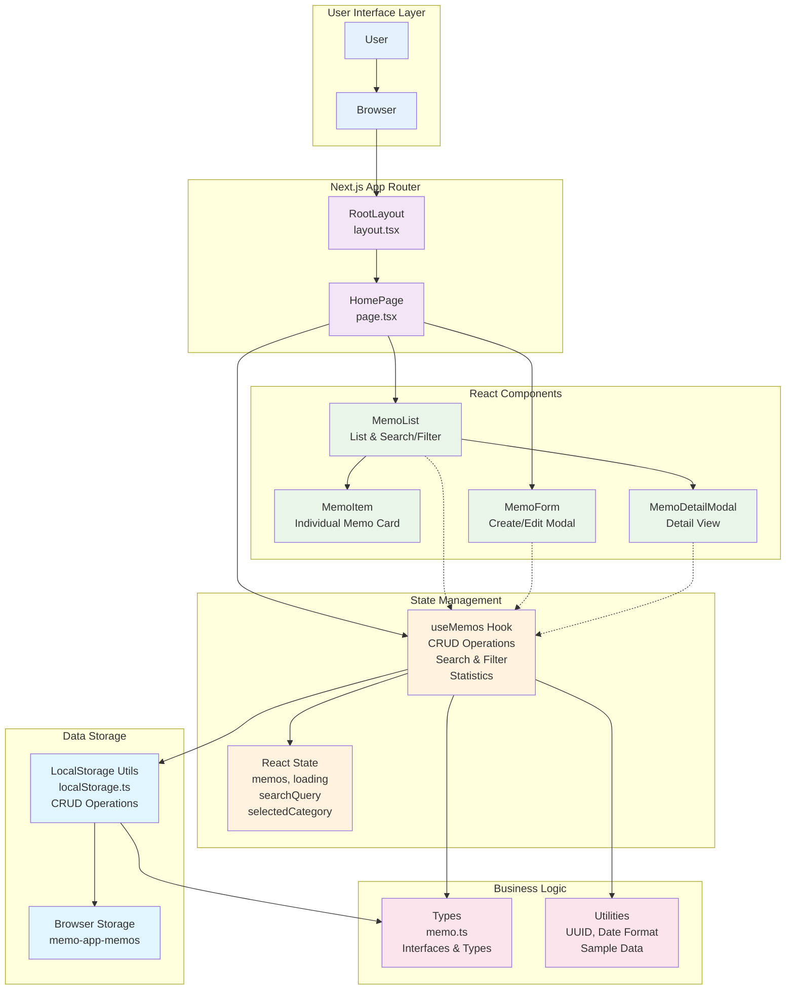

# 메모 앱 시스템 아키텍처

## 개요

이 다이어그램은 Next.js 기반 메모 앱의 전체 시스템 아키텍처를 보여줍니다. 클라이언트 사이드 애플리케이션으로 LocalStorage를 데이터 저장소로 사용하며, React 컴포넌트와 커스텀 훅을 통한 상태 관리 패턴을 구현하고 있습니다.

## 아키텍처 다이어그램

## 컴포넌트 상세 설명

### UI 레이어
- **사용자**: 웹 브라우저를 통해 메모 앱과 상호작용
- **브라우저**: Next.js 애플리케이션을 렌더링하고 LocalStorage 제공

### Next.js App Router
- **RootLayout**: 전역 레이아웃, 폰트 설정, 메타데이터 관리
- **HomePage**: 메인 페이지, 메모 목록과 폼을 통합 관리

### React 컴포넌트
- **MemoList**: 메모 목록 표시, 검색/필터 기능, 통계 정보
- **MemoItem**: 개별 메모 카드, 미리보기 및 액션 버튼
- **MemoForm**: 메모 생성/수정을 위한 모달 폼
- **MemoDetailModal**: 메모 상세 내용을 보여주는 모달

### 상태 관리
- **useMemos Hook**: 메모 관련 모든 비즈니스 로직과 상태 관리
- **React State**: 메모 데이터, 로딩 상태, 검색 쿼리, 선택된 카테고리

### 비즈니스 로직
- **Types**: TypeScript 인터페이스와 타입 정의
- **Utilities**: UUID 생성, 샘플 데이터 시딩 등의 유틸리티 함수

### 데이터 저장
- **LocalStorage Utility**: 브라우저 LocalStorage와의 인터페이스
- **Browser Storage**: 실제 데이터가 저장되는 브라우저 저장소

## 데이터 플로우

1. **생성**: 사용자 → MemoForm → useMemos → LocalStorage → Browser Storage
2. **조회**: Browser Storage → LocalStorage → useMemos → MemoList → MemoItem
3. **수정**: MemoItem → MemoForm → useMemos → LocalStorage → Browser Storage
4. **삭제**: MemoItem → useMemos → LocalStorage → Browser Storage
5. **검색/필터**: MemoList → useMemos → 필터링된 결과 반환

## 기술 스택

- **Frontend**: Next.js 15, React 19, TypeScript
- **스타일링**: TailwindCSS 4
- **상태 관리**: React Hooks (useState, useEffect, useCallback, useMemo)
- **데이터 저장**: Browser LocalStorage
- **ID 생성**: UUID v4
- **테스팅**: Playwright

## 특징

- **클라이언트 사이드 애플리케이션**: 서버 없이 브라우저에서 완전히 동작
- **반응형 디자인**: 모바일과 데스크톱 모두 지원
- **실시간 검색**: 타이핑과 동시에 메모 필터링
- **카테고리 관리**: 5개 카테고리로 메모 분류
- **태그 시스템**: 다중 태그를 통한 메모 분류
- **통계 정보**: 전체/카테고리별 메모 개수 표시